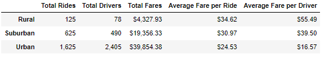
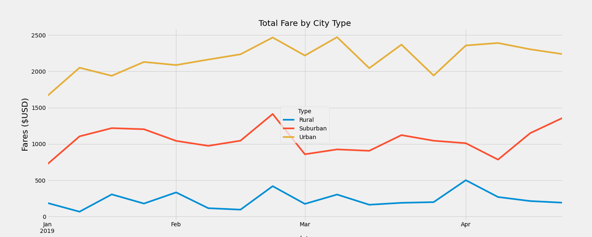

# pyber_analysis

## Overview
---
I've received an incredible work assignment to assist PyBer, a rideshare company, in creating visualizations to determine affordability for underserved neighborhoods. After presenting my initial findings to the leadership team, I was tasked with creating new visualizations for weekly fares for each city type (Urban, Suburban and Rural).

## Results
---

Upon further research into the cost of rides depending on the city type, I found that the fewer drivers within a specific city type, the fewer rides they ended up making and ultimately the more that individual made per ride. 

### Summary by City Type
---
In this image, you are able to see data to back up the claims of Rural drivers being more profitable per ride than drivers in other city types. 

Furthermore, we can see here that over the course of a 4 month period, there was no change in our findings. Rural drivers, no matter the date, are still our most profitable drivers while drivers in Urban cities make the least per ride.

## Summary
In conclusion, our findings present a great disparity in the Pyber consumer experience depending on their locale. I propose the following recommendations.

1.   I suspect that the greatly reduced number of rides in Rural areas is greatly to due with the cost per ride. in an effort to both make our services more affordable to entice a greater number of users, I believe we should decrease the ride costs in Rural areas. I suspect that a decrease in cost will bring in more users, increasing the demand for more drivers in the area.

2. Conversely to the first point, I believe that an increase in Urban city rides would provide an increase in overall revenue while having limited impact to user experience as the population is already accustomed to the ease of use PyBer provides them.

3. Finally, I would encourage further investigation and analysis into ride length per city type. Possible variations of ride length and distance could be additional contributing factors of the disparities seen in between city types.

